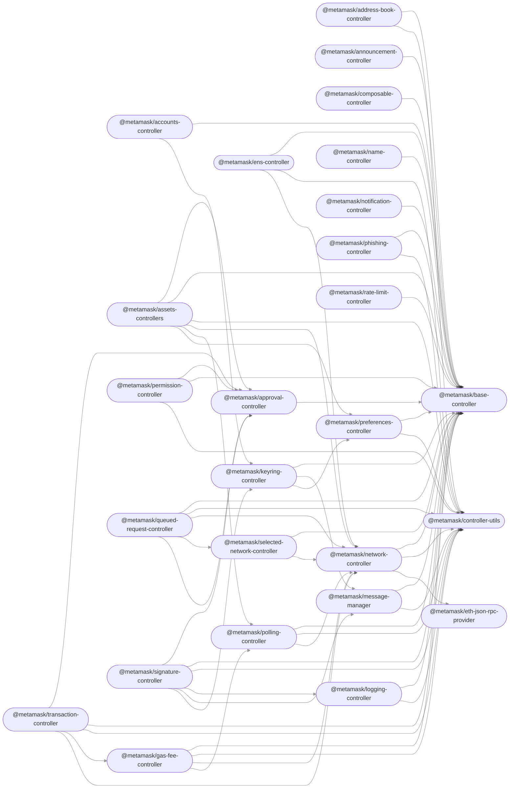

<!-- start dependency graph -->

```mermaid
%%{ init: { 'flowchart': { 'curve': 'bumpX' } } }%%
graph LR;
linkStyle default opacity:0.5
  accounts_controller(["@metamask/accounts-controller"]);
  address_book_controller(["@metamask/address-book-controller"]);
  announcement_controller(["@metamask/announcement-controller"]);
  approval_controller(["@metamask/approval-controller"]);
  assets_controllers(["@metamask/assets-controllers"]);
  base_controller(["@metamask/base-controller"]);
  composable_controller(["@metamask/composable-controller"]);
  controller_utils(["@metamask/controller-utils"]);
  ens_controller(["@metamask/ens-controller"]);
  eth_json_rpc_provider(["@metamask/eth-json-rpc-provider"]);
  gas_fee_controller(["@metamask/gas-fee-controller"]);
  keyring_controller(["@metamask/keyring-controller"]);
  logging_controller(["@metamask/logging-controller"]);
  message_manager(["@metamask/message-manager"]);
  name_controller(["@metamask/name-controller"]);
  network_controller(["@metamask/network-controller"]);
  notification_controller(["@metamask/notification-controller"]);
  permission_controller(["@metamask/permission-controller"]);
  phishing_controller(["@metamask/phishing-controller"]);
  polling_controller(["@metamask/polling-controller"]);
  preferences_controller(["@metamask/preferences-controller"]);
  queued_request_controller(["@metamask/queued-request-controller"]);
  rate_limit_controller(["@metamask/rate-limit-controller"]);
  selected_network_controller(["@metamask/selected-network-controller"]);
  signature_controller(["@metamask/signature-controller"]);
  transaction_controller(["@metamask/transaction-controller"]);
  accounts_controller --> base_controller;
  accounts_controller --> keyring_controller;
  address_book_controller --> base_controller;
  address_book_controller --> controller_utils;
  announcement_controller --> base_controller;
  approval_controller --> base_controller;
  assets_controllers --> approval_controller;
  assets_controllers --> base_controller;
  assets_controllers --> controller_utils;
  assets_controllers --> network_controller;
  assets_controllers --> polling_controller;
  assets_controllers --> preferences_controller;
  composable_controller --> base_controller;
  ens_controller --> base_controller;
  ens_controller --> controller_utils;
  ens_controller --> network_controller;
  gas_fee_controller --> base_controller;
  gas_fee_controller --> controller_utils;
  gas_fee_controller --> network_controller;
  gas_fee_controller --> polling_controller;
  keyring_controller --> base_controller;
  keyring_controller --> message_manager;
  keyring_controller --> preferences_controller;
  logging_controller --> base_controller;
  logging_controller --> controller_utils;
  message_manager --> base_controller;
  message_manager --> controller_utils;
  name_controller --> base_controller;
  network_controller --> base_controller;
  network_controller --> controller_utils;
  network_controller --> eth_json_rpc_provider;
  notification_controller --> base_controller;
  permission_controller --> approval_controller;
  permission_controller --> base_controller;
  permission_controller --> controller_utils;
  phishing_controller --> base_controller;
  phishing_controller --> controller_utils;
  polling_controller --> base_controller;
  polling_controller --> controller_utils;
  polling_controller --> network_controller;
  preferences_controller --> base_controller;
  preferences_controller --> controller_utils;
  queued_request_controller --> base_controller;
  queued_request_controller --> controller_utils;
  queued_request_controller --> network_controller;
  queued_request_controller --> selected_network_controller;
  queued_request_controller --> approval_controller;
  rate_limit_controller --> base_controller;
  selected_network_controller --> base_controller;
  selected_network_controller --> network_controller;
  signature_controller --> approval_controller;
  signature_controller --> base_controller;
  signature_controller --> controller_utils;
  signature_controller --> logging_controller;
  signature_controller --> message_manager;
  signature_controller --> keyring_controller;
  transaction_controller --> approval_controller;
  transaction_controller --> base_controller;
  transaction_controller --> controller_utils;
  transaction_controller --> gas_fee_controller;
  transaction_controller --> network_controller;
```

<!-- end dependency graph -->
